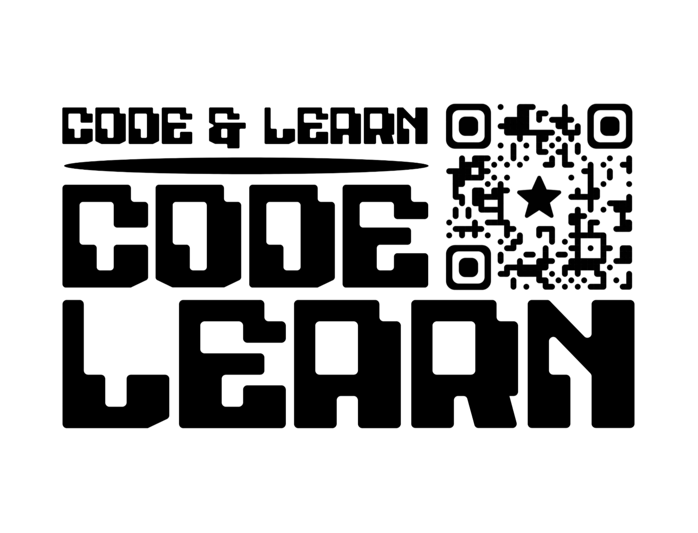

# clearn.top - CRM & Telegram Bot

A comprehensive CRM system with deeply integrated Telegram bot for managing courses, lessons, and payments.



## 🚀 Quick Start

```bash
# Clone and install
git clone <repository>
cd clearn.top
npm install

# Run with Docker
docker-compose up -d --build
```

## 🎓 Course Management System

### Flexible Course Management
- **Configuration**: [`config/courses.js`](config/courses.js) - centralized management of all courses
- **API**: [`utils/courseManager.js`](utils/courseManager.js) - programmatic interface for course operations
- **CLI**: [`scripts/manageCourses.js`](scripts/manageCourses.js) - command line interface for management

### Available Courses
- **Scratch** - Visual Programming (7-11 years)
- **Python Pro** - Python Programming (12+ years)
- **Roblox** - Roblox Game Development (9-12 years)
- **Junior Start** - For Youngest Students (5-7 years)
- **Minecraft** - Minecraft Modding (8-12 years)
- **3D Designer** - 3D Modeling and Design (12+ years)

### Course Management
```bash
# List all courses
node scripts/manageCourses.js list

# Hide/show course
node scripts/manageCourses.js hide minecraft
node scripts/manageCourses.js show minecraft

# Change order
node scripts/manageCourses.js order python 1

# Sync with database
node scripts/manageCourses.js sync
```

## 🌟 Core Features

### 👤 Common Pages
- **Home Page** - course overview with 9 language support
- **Information Pages** - terms, privacy policy, FAQ
- **Authentication** - login/registration with Google OAuth and referral system

### 👑 Administrator
- **Dashboard** - statistics of students, teachers, lessons
- **User Management** - [`routes/admin/users.ejs`](views/admin/users.ejs)
- **Lesson Management** - [`routes/admin/lessons.ejs`](views/admin/lessons.ejs)
- **Payment Management** - [`routes/admin/payments.ejs`](views/admin/payments.ejs)
- **Analytics** - [`routes/admin/analytics.ejs`](views/admin/analytics.ejs)

### 🧑‍🏫 Teacher
- **Dashboard** - weekly lesson count, active students
- **Calendar** - interactive schedule
- **My Students** - list of assigned students
- **Lesson Management** - mark completion, cancellation

### 🎓 Student
- **Dashboard** - paid lessons count, next lesson info
- **My Lessons** - history and future lessons with sequential numbering
- **Progress** - track progress across courses

## 🤖 Telegram Bot

### Integration
- **Handlers**: [`bot/handlers/messageHandler.js`](bot/handlers/messageHandler.js)
- **Keyboards**: [`bot/keyboards/calendarKeyboards.js`](bot/keyboards/calendarKeyboards.js)
- **Services**: [`bot/services/`](bot/services/)

### Bot Features
- Schedule management through interactive calendar
- Mark lessons as completed/no-show
- View teacher contact information
- Manage lesson balance
- Notifications about upcoming lessons
- Referral program

## 🛠️ Technical Architecture

### Backend
- **Framework**: Express.js + EJS
- **Database**: MongoDB with Mongoose
- **Authentication**: Passport.js (Google OAuth)
- **Payments**: Robokassa, Monobank, PayPal integration
- **Notifications**: Telegram Bot API

### Frontend
- **Templates**: EJS with 9 language support
- **Styles**: CSS3 with responsive design
- **JavaScript**: Vanilla JS with modular architecture
- **Translations**: [`public/js/translations.js`](public/js/translations.js) (auto-generated)

### File Structure
```
├── config/           # Configuration (courses, passport, payments)
├── models/           # Mongoose models (User, Course, Lesson, Payment)
├── routes/           # Express routes
├── views/            # EJS templates
├── public/           # Static files (CSS, JS, images)
├── bot/              # Telegram Bot logic
├── services/         # Business logic (payments, notifications)
├── scripts/          # Utilities (sync, course management)
└── utils/            # Helper functions
```

## 🔧 Deployment

### Docker (Recommended)
```bash
docker-compose up -d --build
```

### Local Development
```bash
# Install dependencies
npm install

# Setup environment variables
cp .env.example .env
# Edit .env file

# Run
npm start
```

### Environment Variables
```env
MONGO_URI=mongodb://...
SESSION_SECRET=your-secret
GOOGLE_CLIENT_ID=your-google-id
GOOGLE_CLIENT_SECRET=your-google-secret
TELEGRAM_BOT_TOKEN=your-bot-token
```

## 📊 Monitoring & Logs

- **Logging**: [`config/logger.js`](config/logger.js)
- **Scheduler**: [`services/scheduler.js`](services/scheduler.js)
- **Analytics**: [`routes/admin/analytics.ejs`](views/admin/analytics.ejs)

## 🔄 Automation

### On Server Start
1. Course system initialization
2. Translation generation for all languages
3. Course synchronization with database
4. Telegram bot startup

### Scheduled Tasks
- Send notifications about upcoming lessons
- Clean temporary files
- Data synchronization

## 📚 Documentation

- **API**: [`other/documentation/`](other/documentation/)
- **Architecture**: [`other/payment-bot/ARCHITECTURE.md`](other/payment-bot/ARCHITECTURE.md)
- **Deployment**: [`other/payment-bot/DEPLOY.md`](other/payment-bot/DEPLOY.md)

## 🎯 Features

- **Multilingual**: 9 languages (EN, RU, DE, HE, PL, NL, UK, ES, IT)
- **Smart Memory**: Form input memory for frequently used fields
- **Sequential Numbering**: Automatic numbering of completed lessons
- **Referral System**: Unique links for user invitations
- **Flexible Course Management**: Easy course addition/hiding
- **Responsive Design**: Works on all devices

## 🚀 Production Ready

The system is fully ready for deployment and requires no additional configuration. All courses, including the new "3D Designer", are automatically activated on startup.